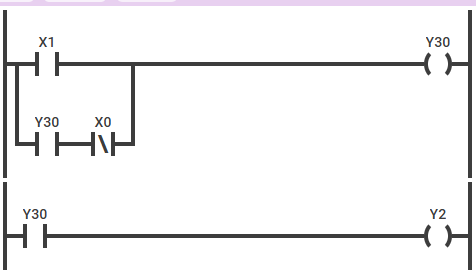

# `造一门编程语言`简化PLC:一次闲得发慌的尝试

我们电子实训第一周PLC编程课程的验收工作是做一个四层电梯开关控制，要求非常复杂。

我是一个工作记忆很糟糕的人，这种非常底层的编程总是记住了前面忘掉了后面，低级错误也没少犯过，在只教授了输入线圈和输出线圈这两种最基本的`语句`，加上那个时不时崩溃的狗屎国产PLC仿真软件，设计这种程序让我感觉纯坐牢。

所以我根据自己对状态机的基本理解，设计了一款非常简单的DSL，我首先认为这个电梯程序的所有逻辑都可以写成一个if-util的形式，即首先通过一个输入线圈激活一个状态，然后保持这个状态，直到设定的条件被满足，再取消这个状态。

我并不清楚其他人是怎么保持状态的，我是使用的一个中间变量，因为如果直接将输入与输出相连，输出并不知道之前是哪个状态导致了这个结果(我的理解正确吗？后面再想想看吧！)


如下图所示，我引入了中间变量`Y30`作为中间变量，`X1`和`!X0`为条件，当条件被满足的时候`Y30`被激活，此时`Y30`这个状态会一直持续到`Y1`不被满足的情况(当然，你也完全可以换成是`Y1`被满足)

*写到这里的时候我才发现我的程序没有做`非`的处理，因此你是应该是没有办法用我现在的语法写出这个图的。但是B是要装的，后面慢慢改吧！*



我认为上述的基本模型已经可以涵盖这个电梯程序的所有方面，所以我的DSL有如下定义:

```
下降按钮 = X1
一层限位 = X0
下降 = Y0

if(下降按钮)下降
util(一层限位)
```

然后，运行程序会调用Mermaid自动生成梯形图。

我对那些没有使用中间变量实现的`状态转移`的方法挺感兴趣的，这算是纪念我的一个思路吧。